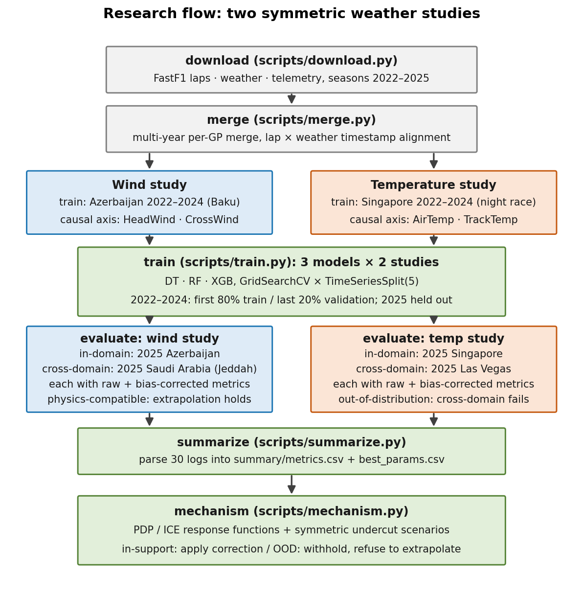
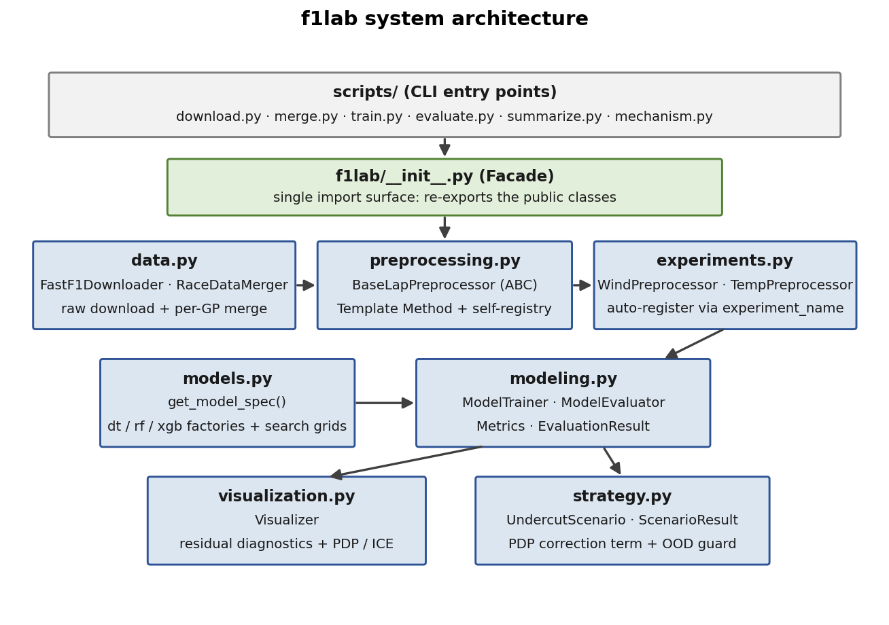

# Applying Machine Learning Techniques to F1 Telemetry Data Analysis

[](https://github.com/terencechou1022/F1_LapTime_Prediction/actions/workflows/ci.yml)


Two symmetric machine-learning studies quantify how **wind** and **temperature** shift Formula 1 lap times in the 2022–2025 ground-effect era — feeding a pit-stop strategy layer that **refuses to predict outside its training support**.


Same features-minus-cause baseline, same splits, same model — opposite verdicts on the 2025 cross-domain races. The wind model, trained only on Baku, transfers to Jeddah (raw R² 0.16 vs 0.21 in-domain: a physics-compatible circuit pair). The temperature model, trained on Singapore's 27.6–37.4 °C, meets Las Vegas at ~17 °C — out of distribution — and the strategy layer withholds its correction instead of extrapolating. Forcing a prediction anyway scores **R² = −6.08**: the refusal is empirically earned, not cautious hand-waving.

## Highlights

- **Flips a real pit-stop call.** On the measured 2025 Saudi GP peak headwind (+1.38 m/s), the PDP-derived correction adds +0.39 s over 10 laps to the rival's window — a borderline undercut flips **CLOSE → OPEN**. That is exactly the 0.1–0.5 s scale where real pit decisions live.
- **Knows when not to predict.** The correction term applies iff the current condition lies inside the training support — a one-line, human-auditable test backed by the measured cross-domain failure above.
- **A controlled generalization experiment.** Both studies share an identical 9-feature control baseline and identical time-ordered splits, differing *only* in their causal variables — so wind-transfers-vs-temp-fails is attributable to the mechanism, not to modeling choices.
- **Folklore, quantified.** Within training support: TrackTemp ≈ **−0.06 s/°C**, CrossWind ≈ **+0.03 s per m/s** — PDP-extracted from the Random Forest, stability-checked with ICE curves.
- **Engineering to match.** Four GoF patterns enforce the symmetric design, 16 deterministic tests + ruff gate every push in CI, and the entire result set regenerates from one command.

## The two studies

| Experiment | Question | Training data | 2025 test races |
|---|---|---|---|
| **wind** | How do head/cross winds inflate lap times at a high-speed street circuit? | Azerbaijan GP 2022–2024 | Azerbaijan (in-domain), Saudi Arabia (cross-domain) |
| **temp** | How does air/track temperature drive tyre degradation? | Singapore GP 2022–2024 | Singapore (in-domain), Las Vegas (cross-domain) |

Headline results (Random Forest, the common main model — full 3-model × 4-condition tables in [docs/methodology.md](docs/methodology.md)):

| Study | In-domain 2025 (raw) | Cross-domain 2025 (raw) |
|---|---|---|
| **wind** (Azerbaijan → Saudi Arabia) | R² 0.209, MAE 0.457 s | R² 0.163 — physics-compatible regime, generalization holds |
| **temp** (Singapore → Las Vegas) | R² 0.420, MAE 0.885 s | R² −6.080 — out-of-support (~17 °C vs 27.6–37.4 °C), correction withheld |

## Quickstart

```bash
git clone https://github.com/terencechou1022/F1_LapTime_Prediction.git
cd F1_LapTime_Prediction
python -m venv .venv
source .venv/Scripts/activate      # bash on Windows · .venv\Scripts\activate in PowerShell

pip install -r requirements.txt    # exact locked versions (reproduces the reported numbers)
pip install -e .[dev]              # editable package + pytest/ruff
```

Prove the pipeline works in under a minute — no race data or network needed for the tests:

```bash
python -m pytest tests/ -q                                        # 16 tests, ~2 s
python scripts/train.py --experiment wind --model all --quick --no-plots   # real pipeline, tiny grids, ~15 s
```

The merged race data (`data/merged/`, ~2 MB) and headline results (`summary/*.csv`) ship with the repo. Pretrained models (54 MB, six `.joblib`) are attached to the GitHub Release — drop them into `models/` and the evaluation and mechanism steps run in minutes:

```bash
python scripts/evaluate.py --experiment temp-cross-domain   # the −6.08 headline, all three models
python scripts/mechanism.py                                 # 8 PDP/ICE figures + both undercut scenarios
```

Full-from-scratch reproduction (download → merge → 6 grid-search trainings → 24 evaluations → summary → mechanism) is one command — `python run.py` (`--dry-run` previews the 32 steps) — and costs **~75–80 h** on an 8-core CPU; step-by-step commands are below.

## Pipeline



```bash
# 1. Download raw laps/weather/telemetry (fastf1, rate-limited)
python scripts/download.py --start 2022 --end 2025

# 2. Merge per-year laps + weather into one tidy file per circuit/era
python scripts/merge.py Azerbaijan_Grand_Prix --years 2022 2023 2024
python scripts/merge.py Azerbaijan_Grand_Prix --years 2025
python scripts/merge.py Saudi_Arabian_Grand_Prix --years 2025
python scripts/merge.py Singapore_Grand_Prix --years 2022 2023 2024
python scripts/merge.py Singapore_Grand_Prix --years 2025
python scripts/merge.py Las_Vegas_Grand_Prix --years 2025

# 3. Train (GridSearchCV × TimeSeriesSplit(5); --model dt | rf | xgb | all)
python scripts/train.py --experiment wind --save
python scripts/train.py --experiment temp --save

# 4. Evaluate on the held-out 2025 races (in-domain + cross-domain, raw + bias-corrected)
python scripts/evaluate.py --experiment wind --model all
python scripts/evaluate.py --experiment wind-cross-domain --model all
python scripts/evaluate.py --experiment temp --model all
python scripts/evaluate.py --experiment temp-cross-domain --model all

# 5. Collate logs → summary/metrics.csv (24 rows) + summary/best_params.csv (6 rows)
python scripts/summarize.py

# 6. PDP/ICE figures + the two symmetric undercut-scenario tables
python scripts/mechanism.py
```

Both `train.py` and `evaluate.py` accept `--no-plots` (headless) or `--save-plots-dir DIR`; the full run writes **234 diagnostic PNGs** (prediction-vs-actual, residual distribution/vs-predicted/vs-feature, feature importance) to `plots/`.

## Methodology in one paragraph

Time-ordered 80/20 split within 2022–2024 (validation = last 20%), `TimeSeriesSplit(5)` for tuning inside the training portion only, and the full 2025 races as truly unseen tests — 2022–2025 is one regulatory era, so 2025 measures within-era generalization. The target is `LapTimeDelta = LapTime − min(LapTime per driver-stint)`; pit laps, non-green laps, and the lap after either are filtered out. Year-on-year drift shows up as a median residual offset (≈ −0.17 s wind, −0.37 s temp) and is handled by opt-in post-hoc bias correction — never by mixing 2025 into training. Three models (DT/RF/XGB) are compared over 648–2,160-combination grids with reachable defaults and boundary margins; RF stays the main model (within 0.07 of the best hold-out R² in both studies, best 2025-test generalization, most stable PDPs). **Full detail: [docs/methodology.md](docs/methodology.md).**

## Architecture



The `f1lab` package is built around four GoF design patterns — they are what enforce the symmetric experiment design:

| Pattern | Where | Purpose |
|---|---|---|
| **Template Method** | `BaseLapPreprocessor.run()` | Locks the 6-step pipeline order; subclasses fill in hooks |
| **Registry / Open–Closed** | `_registry` + `__init_subclass__` | New experiments self-register — no base-class edits |
| **Strategy** | `ModelTrainer(preprocessor)` / `ModelEvaluator(...)` | Preprocessor injected at construction time |
| **Facade** | `f1lab/__init__.py` | Single import surface |

Adding a third study is one small class:

```python
class FooPreprocessor(BaseLapPreprocessor):
    experiment_name: ClassVar[str] = "foo"   # auto-registers

    @property
    def feature_columns(self) -> list[str]:
        return [*self.BASE_FEATURES, "FooAxis1", "FooAxis2"]
```

## Repository layout

```
.
├── f1lab/                 # OOP package — preprocessing, modeling, visualization, strategy, data I/O
├── scripts/               # CLI entry points (download / merge / train / evaluate / summarize / mechanism / diagrams)
├── tests/                 # pytest suite — synthetic fixtures, no race data or network needed
├── notebooks/             # 01_eda.ipynb + 02_walkthrough.ipynb — executed, outputs included
├── demo/                  # Streamlit undercut demo with the OOD-refusal UX
├── docs/
│   ├── methodology.md     # standalone research summary (design, results, limitations)
│   ├── retrospective.md   # engineering retrospective — the lessons behind the design
│   └── img/               # committed figures (hero, diagrams, PDPs)
├── data/merged/           # 6 merged race files (~2 MB) — the pipeline's actual inputs, committed
├── summary/               # metrics.csv + best_params.csv — the headline numbers, committed
├── models/                # gitignored — six .joblib via GitHub Release (or retrain ~75–80 h)
├── plots/  logs/          # gitignored — regenerated outputs
├── run.py                 # one-command full reproduction (cross-platform)
├── pyproject.toml         # packaging (pip install -e .) + ruff config
└── requirements.txt       # exact pinned dependency lock
```

## Docs & demos

- **[EDA notebook](notebooks/01_eda.ipynb)** — what the data says before any model: where 12–26% of laps go, sector times proven to be leakage (r = 1.000), the target's heavy tail that caps achievable R², and the temperature gap that makes the Las Vegas failure predictable. Needs no models and no network — runs in ~20 s on a fresh clone.
- **[Walkthrough notebook](notebooks/02_walkthrough.ipynb)** — the modelling story, executed with outputs (rendered directly on GitHub): load → evaluate the four 2025 conditions → PDP/ICE → both undercut scenarios, ending in the CLOSE→OPEN flip and the OOD refusal. Re-runs in ~3 min with the pretrained models.
- **[Interactive demo](demo/)** — Streamlit app: drag the condition slider past the training support and watch the correction get withheld in real time. `pip install -e .[demo]`, then `streamlit run demo/app.py`.
- **[Methodology](docs/methodology.md)** — data, symmetric design, split discipline, model selection, full result tables, mechanism extraction, the undercut scenarios, and an honest limitations list.
- **[Engineering retrospective](docs/retrospective.md)** — why the design ended up this way: attribution-first experiment structure, the OOD-refusal position, leakage decisions, grid design philosophy, and what writing the tests revealed.

## Data & usage

Published as a portfolio piece for review — no open-source license is granted, so the code carries default copyright and is not offered for reuse. No claim is made on the underlying F1 timing data either: it belongs to the FIA / Formula One Group and is accessed via the public [`fastf1`](https://docs.fastf1.dev/) API; the merged files in `data/merged/` are derived, non-commercial research artifacts provided for reproducibility.

*This project is unofficial and is not associated in any way with the Formula 1 companies. F1, FORMULA ONE, FORMULA 1, FIA FORMULA ONE WORLD CHAMPIONSHIP, GRAND PRIX and related marks are trade marks of Formula One Licensing B.V.*
