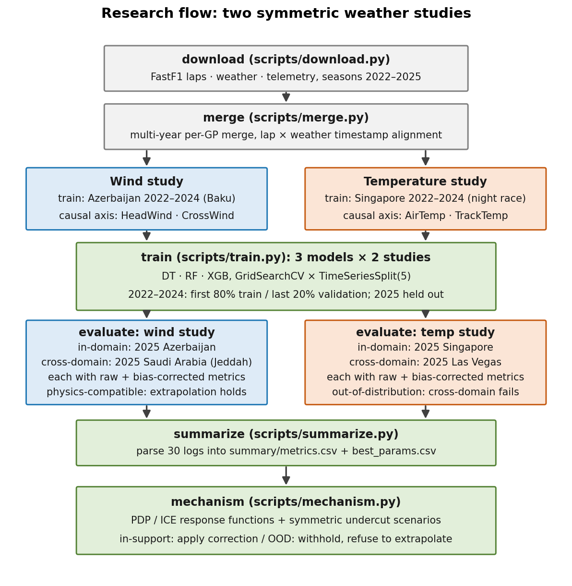
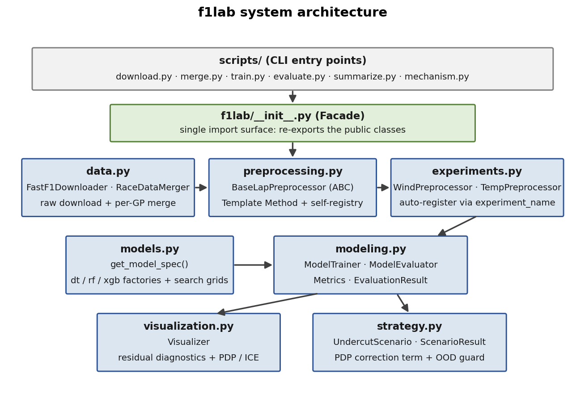

# F1 單圈時間預測：量化風與溫度，並在分佈外拒絕預測

[](https://github.com/terencechou1022/F1_LapTime_Prediction/actions/workflows/ci.yml)

兩組對稱的機器學習研究，量化 **風** 與 **溫度** 在 2022–2025 地面效應時代如何改變 F1 單圈時間，並以此餵給一層進站策略——**超出訓練支撐區間時，它拒絕預測**。


同一組「扣掉成因」的控制基線、同一套切分、同一種模型，在 2025 年的跨域賽事上卻得到相反的結論。風的模型只在 Baku 訓練，卻能轉移到 Jeddah（原始 R² 0.16，同域是 0.21：這是一組物理條件相容的賽道）。溫度的模型訓練於新加坡的 27.6–37.4 °C，遇上約 17 °C 的 Las Vegas——落在分佈外——策略層於是收回它的修正量，而不是往外推。硬要它預測的話會得到 **R² = −6.08**：這個「拒絕」是實測換來的，不是保守的場面話。

## 重點

- **它翻掉了一次真實的進站決策。** 在 2025 沙烏地 GP 實測的最大逆風（+1.38 m/s）下，由 PDP 導出的修正量替對手的視窗在 10 圈內多加了 +0.39 秒——一次原本在邊緣的 undercut 從 **CLOSE 翻成 OPEN**。那正是 0.1 至 0.5 秒這個真實進站決策所在的尺度。
- **它知道什麼時候不該預測。** 修正量只在當前條件落在訓練支撐區間內才套用——一行就能寫完、人看得懂也查得動的判斷，背後有上面那組實測的跨域失敗當證據。
- **這是一組受控的泛化實驗。** 兩項研究共用一模一樣的 9 個控制特徵基線與一模一樣的時序切分，**只有**因果變數不同——所以「風能轉移、溫度不能」這件事可歸因於機制本身，而不是建模時的選擇。
- **把口耳相傳的說法量化。** 在訓練支撐區間內：TrackTemp 約 **−0.06 s/°C**、CrossWind 約 **+0.03 秒每 m/s**——由 Random Forest 以 PDP 抽出，並用 ICE 曲線檢查過穩定性。
- **工程面跟上。** 四個 GoF 模式撐住這套對稱設計，17 個確定性測試在 CI 守住每一次推送，而整組結果可由一道指令重新產生。

## 兩項研究

| 實驗 | 問題 | 訓練資料 | 2025 測試賽事 |
|---|---|---|---|
| **wind** | 逆風與側風如何在高速街道賽道上拉長單圈時間？ | 亞塞拜然 GP 2022–2024 | 亞塞拜然（同域）、沙烏地阿拉伯（跨域） |
| **temp** | 氣溫與賽道溫度如何驅動輪胎衰退？ | 新加坡 GP 2022–2024 | 新加坡（同域）、Las Vegas（跨域） |

主要結果（Random Forest，兩項研究共同的主模型——完整的 3 模型 × 4 條件表格在 [docs/methodology.md](docs/methodology.md)）：

| 研究 | 2025 同域（原始） | 2025 跨域（原始） |
|---|---|---|
| **wind**（亞塞拜然 → 沙烏地阿拉伯） | R² 0.209、MAE 0.457 秒 | R² 0.163——物理條件相容，泛化成立 |
| **temp**（新加坡 → Las Vegas） | R² 0.420、MAE 0.885 秒 | R² −6.080——超出支撐區間（約 17 °C vs 27.6–37.4 °C），修正量被收回 |

## 快速開始

```bash
git clone https://github.com/terencechou1022/F1_LapTime_Prediction.git
cd F1_LapTime_Prediction
python -m venv .venv
source .venv/Scripts/activate      # Windows 上的 bash；PowerShell 用 .venv\Scripts\activate

pip install -r requirements.txt    # 釘死的版本（重現本文報告的數字）
pip install -e .[dev]              # 可編輯安裝 + pytest
```

一分鐘內證明管線能跑——測試不需要賽事資料，也不需要網路：

```bash
python -m pytest tests/ -q                                        # 17 個測試，約 2 秒
python scripts/train.py --experiment wind --model all --quick --no-plots   # 真實管線，極小網格，約 15 秒
```

合併後的賽事資料（`data/merged/`，約 2 MB）與主要結果（`summary/*.csv`）都隨 repo 一起版控。預訓練模型（54 MB，六個 `.joblib`）掛在 GitHub Release，放進 `models/` 之後，評估與機制抽取這兩步幾分鐘就能跑完：

```bash
python scripts/evaluate.py --experiment temp-cross-domain   # 那個 −6.08 的結果，三個模型都跑
python scripts/mechanism.py                                 # 8 張 PDP/ICE 圖 + 兩組 undercut 情境
```

從零完整重現（下載 → 合併 → 6 次網格搜尋訓練 → 24 次評估 → 彙整 → 機制抽取）是一道指令——`python main.py`（`--dry-run` 可預覽那 32 個步驟）——在 8 核 CPU 上約需 **75 至 80 小時**；逐步指令見下。

## 管線



```bash
# 1. 下載原始的圈速／天氣／遙測（fastf1，有速率限制）
python scripts/download.py --start 2022 --end 2025

# 2. 把各年度的圈速與天氣合併成每賽道／每時代一份整齊的檔案
python scripts/merge.py Azerbaijan_Grand_Prix --years 2022 2023 2024
python scripts/merge.py Azerbaijan_Grand_Prix --years 2025
python scripts/merge.py Saudi_Arabian_Grand_Prix --years 2025
python scripts/merge.py Singapore_Grand_Prix --years 2022 2023 2024
python scripts/merge.py Singapore_Grand_Prix --years 2025
python scripts/merge.py Las_Vegas_Grand_Prix --years 2025

# 3. 訓練（GridSearchCV × TimeSeriesSplit(5)；--model dt | rf | xgb | all）
python scripts/train.py --experiment wind --save
python scripts/train.py --experiment temp --save

# 4. 在保留的 2025 賽事上評估（同域 + 跨域，原始 + 偏差修正後）
python scripts/evaluate.py --experiment wind --model all
python scripts/evaluate.py --experiment wind-cross-domain --model all
python scripts/evaluate.py --experiment temp --model all
python scripts/evaluate.py --experiment temp-cross-domain --model all

# 5. 彙整 log → summary/metrics.csv（24 列）+ summary/best_params.csv（6 列）
python scripts/summarize.py

# 6. PDP/ICE 圖 + 兩組對稱的 undercut 情境表
python scripts/mechanism.py
```

`train.py` 與 `evaluate.py` 都接受 `--no-plots`（無視窗）或 `--save-plots-dir DIR`；完整跑完會把 **234 張診斷 PNG**（預測對實際、殘差分佈／對預測值／對特徵、特徵重要度）寫進 `plots/`。

## 方法論，一段講完

在 2022–2024 之內做時序 80/20 切分（驗證集是最後 20%），調參時只在訓練那一段內用 `TimeSeriesSplit(5)`，而 2025 整場賽事是真正沒見過的測試集——2022–2025 屬於同一個規則時代，所以 2025 量的是時代內的泛化能力。預測目標是 `LapTimeDelta = LapTime − min(每位車手每個 stint 的 LapTime)`；進站圈、非全綠旗圈，以及這兩者的下一圈都會被濾掉。年度之間的漂移會以殘差中位數的偏移呈現（風約 −0.17 秒、溫度約 −0.37 秒），處理方式是可選用的事後偏差修正——絕不把 2025 混進訓練。三個模型（DT/RF/XGB）在 648 至 2,160 種組合的網格上比較，網格設計讓每個函式庫預設值都搆得到、每個軸都留有邊界餘裕；RF 維持主模型地位（兩項研究的保留集 R² 都在最佳值的 0.07 以內、2025 測試集的泛化最好、PDP 也最穩）。**完整細節：[docs/methodology.md](docs/methodology.md)。**

## 架構



`f1lab` 套件圍繞四個 GoF 設計模式構成——正是它們撐住了這套對稱的實驗設計：

| 模式 | 位置 | 用途 |
|---|---|---|
| **Template Method** | `BaseLapPreprocessor.run()` | 鎖住 6 步驟的管線順序，子類別只填 hook |
| **Registry / 開放封閉原則** | `_registry` + `__init_subclass__` | 新實驗自動註冊，不必改基底類別 |
| **Strategy** | `ModelTrainer(preprocessor)` / `ModelEvaluator(...)` | 前處理器在建構時注入 |
| **Facade** | `f1lab/__init__.py` | 單一匯入介面 |

要加第三項研究，只需要一個小類別：

```python
class FooPreprocessor(BaseLapPreprocessor):
    experiment_name: ClassVar[str] = "foo"   # 自動註冊

    @property
    def feature_columns(self) -> list[str]:
        return [*self.BASE_FEATURES, "FooAxis1", "FooAxis2"]
```

## 專案結構

```
.
├── f1lab/                 # OOP 套件：前處理、建模、視覺化、策略層、資料 I/O
├── scripts/               # CLI 入口（download / merge / train / evaluate / summarize / mechanism / diagrams）
├── tests/                 # pytest 測試：合成 fixture，不需賽事資料與網路
├── docs/
│   ├── methodology.md     # 可獨立閱讀的研究摘要（設計、結果、限制）
│   ├── retrospective.md   # 工程回顧：這些設計背後的取捨
│   └── img/               # 已納入版控的圖（主圖、架構圖、PDP）
├── data/merged/           # 6 份合併後的賽事檔（約 2 MB）——管線真正的輸入，已納入版控
├── summary/               # metrics.csv + best_params.csv——主要數字，已納入版控
├── models/                # 已 gitignore——六個 .joblib 掛在 GitHub Release（或重訓 75 至 80 小時）
├── plots/  logs/          # 已 gitignore——重跑就會重新產生
├── main.py                # 一道指令完成完整重現（跨平台）
├── pyproject.toml         # 打包（pip install -e .）+ pytest 設定
└── requirements.txt       # 釘死版本的相依鎖定
```

## 文件

- **[方法論](docs/methodology.md)**——資料、對稱設計、切分紀律、模型選擇、完整結果表、機制抽取、undercut 情境，以及一份誠實的限制清單。
- **[工程回顧](docs/retrospective.md)**——為什麼設計成這樣：以歸因為先的實驗結構、OOD 拒絕預測的立場、洩漏相關的決定、網格設計的哲學，以及寫測試時才浮現的東西。

## 資料與使用聲明

本專案作為作品集公開供人閱讀，未授予任何開源授權，因此程式碼保留預設著作權，不提供再利用。底層的 F1 計時資料同樣不主張任何權利：它屬於 FIA／Formula One Group，經由公開的 [`fastf1`](https://docs.fastf1.dev/) API 取得；`data/merged/` 裡的合併檔案是衍生的非商業研究產物，提供出來只是為了可重現性。

*本專案為非官方作品，與 Formula 1 相關公司無任何關聯。F1、FORMULA ONE、FORMULA 1、FIA FORMULA ONE WORLD CHAMPIONSHIP、GRAND PRIX 及相關標誌均為 Formula One Licensing B.V. 之商標。*
