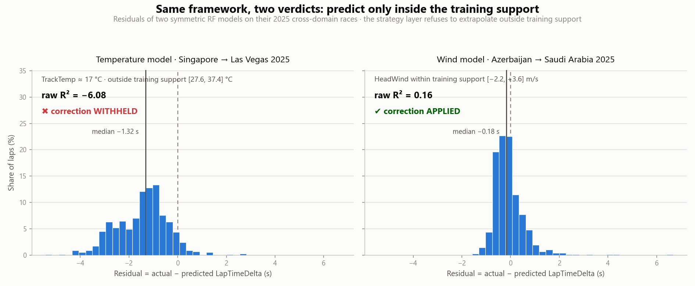
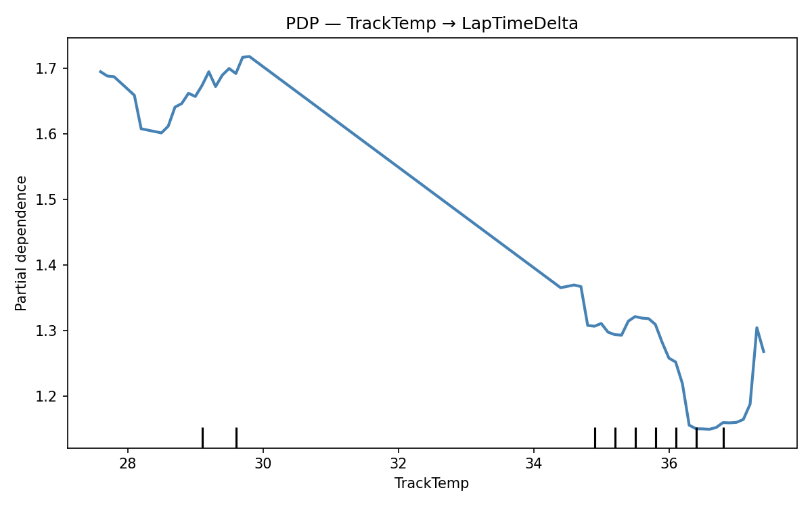
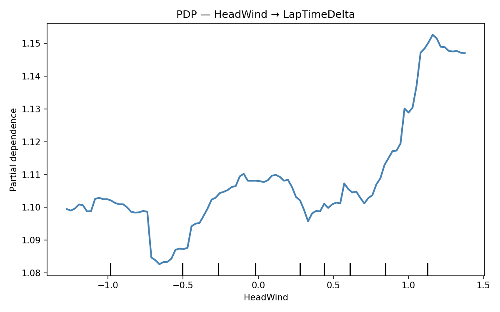

# Methodology

Quantifying weather effects on Formula 1 lap times in the 2022–2025 ground-effect era — and testing exactly where such models stop being trustworthy.

This is the standalone research summary behind the codebase. Every number below is produced by the pipeline in this repository; see [Reproducing these results](#reproducing-these-results).

## 1. Motivation & research questions

F1 engineering folklore treats weather qualitatively: "heat accelerates tyre degradation", "a headwind down the main straight costs lap time". These claims are directionally accepted but rarely stated in units a strategist could act on. This research project asks two questions:

1. **Quantification** — how many *seconds per lap, per unit of environmental change* (per m/s of wind, per °C of temperature) does a given mechanism cost, once tyre state, fuel load, and race progression are controlled for?
2. **Validity boundary** — where does such a model *stop working*? A regression will happily emit a number for any input; the second question is whether the model can be made to know, and declare, when its answer has no statistical support.

Both questions are answered with the same instrument: two structurally identical studies — one for wind, one for temperature — that differ only in the causal variable under investigation. One of them generalizes across circuits; the other fails catastrophically out-of-distribution. That contrast, and the design that makes it attributable to the mechanism rather than to modeling choices, is the core result.

## 2. Data

- **Source**: open F1 timing and weather telemetry via the public [`fastf1`](https://docs.fastf1.dev/) API. Lap tables and weather tables are downloaded per race (`scripts/download.py`), then joined per race with a backward-direction as-of merge on session time (`RaceDataMerger` in `f1lab/data.py`) — each lap picks up the most recent weather sample at or before its timestamp — and written as one tidy Excel file per circuit/era (`scripts/merge.py`).
- **Era**: 2022–2025, the ground-effect regulatory era. All four seasons run under one set of technical regulations, which is what makes 2025 a legitimate *within-era* held-out test rather than a regime change.
- **Circuits** (four, two per study):

| Study | Training + in-domain test | Cross-domain test | Why this pair |
|---|---|---|---|
| **wind** | Azerbaijan GP (Baku), 2022–2024 train, 2025 test | Saudi Arabia GP (Jeddah), 2025 | Matching wind-physics regime: both high-speed street circuits |
| **temp** | Singapore GP, 2022–2024 train, 2025 test | Las Vegas GP, 2025 | The only viable cold-end contrast on the 2022–2025 calendar |

- **Working matrices** after preprocessing: wind training data `X = (2248, 13)`; temp training data `X = (2366, 14)`. The column-count difference is purely the compound one-hot: Azerbaijan's training races used SOFT/MEDIUM/HARD (3 indicator columns), Singapore's also saw INTERMEDIATE (4).

## 3. The symmetric dual-axis design

The core methodological idea: **two models share an identical 9-feature baseline of control variables and identical train/validation/test splits, and differ only in the two causal variables each study claims.** Any difference in behaviour between the two studies is therefore attributable to the mechanism and its training distribution — not to model choice, feature-set asymmetry, or split luck.

**Shared baseline controls** (`BASE_FEATURES`, 9 features):

| Feature | Definition |
|---|---|
| `LapNumber` | Race progression — a confounder for any lap-time model (drives both tyre-wear accumulation and fuel dynamics) |
| `LapInStint` | Lap's original position within the driver-stint, computed *before* invalid-lap filtering, so surviving laps keep their true stint position |
| `Compound` | Tyre compound, one-hot encoded |
| `TyreLife` | Raw absolute tyre age in laps (carries across stints for inherited tyres) |
| `TyreLifeNorm` | `TyreLife / max(TyreLife within driver-stint)` — stint-relative position in (0, 1] |
| `FreshTyre` | New-tyre flag |
| `FuelLoad` | `110 − LapNumber × 1.7` kg (published fuel-burn model; Cappello, 2025) |
| `Humidity` | Weather state — affects air density (drag) for both studies |
| `Rainfall` | Weather state — affects surface grip for both studies |

**Study-specific causal variables** (2 each, giving 11 features per study):

| Study | Causal features |
|---|---|
| **wind** | `HeadWind = WindSpeed × cos(WindDirection°)`, `CrossWind = WindSpeed × sin(WindDirection°)` |
| **temp** | `AirTemp`, `TrackTemp` (raw weather columns) |

The design principle: *anything in the baseline is a control; anything study-specific is the cause being claimed.* `AirTemp`/`TrackTemp` are deliberately excluded from the wind study (and vice versa) — including them would let the other mechanism's signal leak into the model whose causal claim is under test. An earlier `TyreLifeNorm × TrackTemp` interaction feature was removed for exactly this reason (it back-doored temperature into the wind model), and because tree ensembles learn such interactions implicitly from main effects.

**Target** (shared): `LapTimeDelta = LapTime − min(LapTime within driver-stint)`, in seconds. Each lap is measured against the best lap of its own stint, which normalizes away driver/car/track-evolution level differences and leaves the within-stint degradation signal.

**Invalid-lap filter** (shared): drop pit-in/pit-out laps, non-green-flag laps (`TrackStatus ≠ '1'`), and the lap immediately following either — those laps reflect traffic, safety-car pace, or cold tyres, not the mechanisms under study. Stint-position features are computed on the *unfiltered* data first, so filtering never distorts a lap's recorded place in its stint.

**Preprocessing pipeline** — both studies run the exact same fixed sequence (`BaseLapPreprocessor.run()`, a template method whose order subclasses cannot change):

1. Sort by `RaceYear → GPName → Driver → LapNumber`
2. Engineer common features (`LapInStint`, `TyreLifeNorm`, `FuelLoad`) on the **unfiltered** data
3. Apply the invalid-lap filter
4. Engineer study-specific features (the causal axis — wind components or raw temperatures)
5. Compute the target `LapTimeDelta`
6. Build the feature matrix: select columns, one-hot encode `Compound`, align columns to the trained model's feature list at evaluation time

A new study plugs in by declaring an `experiment_name` and its `feature_columns` — the base class self-registers it — so the symmetric structure is enforced by the architecture, not by convention.

## 4. Split discipline

- **Train**: first 80% of 2022–2024, time-ordered (`RaceYear → GPName → Driver → LapNumber`)
- **Validation** (within-era hold-out, used for model selection): last 20% of 2022–2024
- **Test** (truly unseen): the full 2025 race(s)
- Hyperparameter search uses `TimeSeriesSplit(n_splits=5)` *inside* the 80% training portion only — no fold ever trains on data from later than its own evaluation slice.

The era boundary matters: 2022–2025 is one regulatory regime, so 2025 measures *within-era generalization* — the practically relevant question ("does last season's model work next season?") — rather than conflating model error with a rules change.

**Year-on-year drift is reported as a finding, never patched by retraining.** The 2025 test residuals show a consistent median offset (~−0.17 s for the wind study, ~−0.37 s for temp): the models, trained on 2022–2024, systematically overestimate 2025 lap-time deltas, because within-stint spread narrowed between the training seasons and 2025 (median delta 0.86 s → 0.71 s at Azerbaijan, 0.82 s → 0.74 s at Singapore; see the [EDA notebook](../notebooks/01_eda.ipynb)). Why it narrowed is not settled by this data — tyre construction, race interruptions and session-specific dynamics are all candidates — so the offset is measured rather than explained away. This is handled by an optional *post-hoc median-residual bias correction* (`ModelEvaluator.evaluate(..., bias_correct=True)`) that subtracts the median residual and reports both raw and corrected metrics. The 2025 data never enters training. The fitted RF offsets are: wind in-domain −0.17 s, wind cross-domain −0.18 s, temp in-domain −0.37 s, temp cross-domain −1.32 s — the last of these is itself diagnostic (see §6).

## 5. Models & selection

Three regression models are trained per study — Decision Tree, Random Forest, XGBoost — each via an independent `GridSearchCV` (`TimeSeriesSplit(5)`, R² scoring), sharing `random_state=42` throughout:

| Model | Grid combinations | Wall-clock / study (8-core CPU) |
|---|---|---|
| DT | 648 | ~30 min |
| RF | 1,875 | ~26 h |
| XGB | 2,160 | ~10–13 h |

Full run (both studies, all models): **~75–80 h**.

The grids are designed so that a selected value is interpretable: **library defaults are reachable on every axis** (a "default wins" outcome is a finding, not a grid gap), and every axis carries **boundary safety margin** (e.g. `n_estimators` extends to 2000, well above the practical ~1000-tree plateau, so a boundary pick can be interrogated via `cv_results_` rather than silently accepted). Per-axis rationale is documented inline in `f1lab/models.py`.

**Decision Tree** (648 combinations):

```python
"max_depth":          [None, 3, 5, 10, 20, 30]   # None and 30 at upper margin
"min_samples_leaf":   [1, 5, 10, 30, 90, 150]    # 1 = sklearn default
"min_samples_split":  [2, 10, 30, 50, 100, 200]  # 2 = sklearn default
"max_features":       [None, "sqrt", 0.5]        # None = all features
```

**Random Forest** (1,875 combinations):

```python
"n_estimators":      [200, 500, 1000, 1500, 2000]
"max_depth":         [None, 3, 5, 10, 20]
"min_samples_leaf":  [1, 5, 10, 30, 90]
"min_samples_split": [2, 10, 30, 50, 100]
"max_features":      ["sqrt", 0.5, 1.0]
```

**XGBoost** (2,160 combinations):

```python
"n_estimators":     [200, 500, 1000, 1500, 2000]   # matches RF
"max_depth":        [3, 6, 10, 15]                 # 6 = XGBoost default
"learning_rate":    [0.05, 0.1, 0.2, 0.3]          # 0.3 = XGBoost default
"subsample":        [0.7, 0.85, 1.0]               # 1.0 = default
"colsample_bytree": [0.7, 0.85, 1.0]               # 1.0 = default
"min_child_weight": [1, 5, 10]                     # 1 = default
```

XGBoost's remaining regularization knobs (`reg_alpha`, `reg_lambda`, `gamma`) are deliberately excluded — they are fine-tuning axes that would push the grid past ~20,000 combinations for marginal insight. Note in the results below that neither winning XGB configuration pins a boundary on the axes that matter: both studies select `learning_rate=0.05` and shallow `max_depth=3`, i.e. the search had room and chose regularized settings.

**Hold-out comparison** (validation = last 20% of 2022–2024):

| Study | Model | Hold-out R² | MAE | RMSE | Selected hyperparameters |
|---|---|---|---|---|---|
| wind | DT | 0.663 | 0.614 | 0.982 | max_depth=10, max_features=sqrt, min_samples_leaf=1, min_samples_split=50 |
| wind | RF | 0.734 | 0.562 | 0.871 | max_depth=None, max_features=0.5, min_samples_leaf=5, min_samples_split=2, n_estimators=1500 |
| wind | XGB | **0.799** | 0.554 | 0.759 | colsample_bytree=1.0, learning_rate=0.05, max_depth=3, min_child_weight=5, n_estimators=200, subsample=0.7 |
| temp | DT | 0.648 | 0.575 | 0.838 | max_depth=3, max_features=0.5, min_samples_leaf=1, min_samples_split=2 |
| temp | RF | **0.685** | 0.522 | 0.793 | max_depth=10, max_features=sqrt, min_samples_leaf=1, min_samples_split=2, n_estimators=500 |
| temp | XGB | 0.668 | 0.542 | 0.813 | colsample_bytree=0.7, learning_rate=0.05, max_depth=3, min_child_weight=1, n_estimators=500, subsample=0.85 |

**Why Random Forest stays the main model.** RF finishes within 0.07 of the best hold-out R² in both studies (wind: RF 0.734 vs XGB 0.799, gap 0.065; temp: RF wins outright at 0.685) — no decisive hold-out winner. RF then wins where it matters for this project: 2025-test generalization (temp study: RF test R² 0.420 vs XGB 0.254 in-domain; RF −6.080 vs XGB −17.420 cross-domain) and PDP stability for the mechanism-extraction step, where the ensemble's variance reduction produces smoother, more trustworthy response curves. The three-model comparison exists precisely so this choice is empirical rather than rhetorical.

## 6. Results

Both studies are evaluated under four conditions: {in-domain, cross-domain} × {raw, bias-corrected}, for all three models. Cell format: **MAE / MSE / RMSE / R²** (MAE and RMSE in seconds).

**Wind (Azerbaijan → Saudi Arabia):**

| Setting | DT | RF | XGB |
|---|---|---|---|
| Azerbaijan in-domain, raw | 0.526/0.505/0.711/−0.042 | 0.457/0.383/0.619/**0.209** | 0.463/0.377/0.614/0.221 |
| Azerbaijan in-domain, bias | 0.516/0.506/0.711/−0.044 | 0.435/0.395/0.628/0.186 | 0.423/0.381/0.617/0.213 |
| Saudi cross-domain, raw | 0.516/0.522/0.723/−0.017 | 0.460/0.430/0.656/**0.163** | 0.465/0.437/0.661/0.149 |
| Saudi cross-domain, bias | 0.496/0.520/0.721/−0.013 | 0.435/0.432/0.657/0.159 | 0.440/0.436/0.660/0.151 |

**Temp (Singapore → Las Vegas):**

| Setting | DT | RF | XGB |
|---|---|---|---|
| Singapore in-domain, raw | 0.850/2.813/1.677/0.378 | 0.885/2.621/1.619/**0.420** | 1.281/3.375/1.837/0.254 |
| Singapore in-domain, bias | 0.835/2.912/1.706/0.356 | 0.821/2.718/1.649/0.399 | 0.932/2.967/1.722/0.344 |
| Las Vegas cross-domain, raw | 1.821/4.192/2.047/−8.244 | 1.516/3.211/1.792/**−6.080** | 2.346/8.353/2.890/−17.420 |
| Las Vegas cross-domain, bias | 0.781/1.015/1.008/−1.239 | 0.817/1.123/1.060/−1.477 | 1.590/3.437/1.854/−6.580 |

**The headline contrast (RF):**

- **Wind generalizes.** Cross-domain raw R² 0.163 sits close to the in-domain 0.209 (bias-corrected: 0.159 vs 0.186). A model trained only on Baku transfers to Jeddah with a modest, quantified degradation — the two circuits share a wind-physics regime, and the model's learned response carries over.
- **Temp fails catastrophically out-of-distribution.** Cross-domain raw R² is **−6.080** — an order of magnitude worse than predicting the mean. Las Vegas track temperatures (~17 °C) sit far below Singapore's entire training range (27.6–37.4 °C); the model has never seen the cold regime and its extrapolation is not merely inaccurate but systematically wrong (the −1.32 s bias offset needed to partially rescue it is itself evidence of regime mismatch).

This asymmetry — usable extrapolation when the physical regime matches, unusable output when it doesn't — is the finding the rest of the design exists to make credible: both studies use the same features-minus-cause baseline, same splits, same grids, same headline model, so the only degree of freedom left to explain the difference is the mechanism and where its training support ends.



## 7. Mechanism extraction

Prediction accuracy alone doesn't answer question 1 (§1). The per-unit effect is extracted from the trained RF via **partial dependence**: the PDP is the model's average response `f(feature) → LapTimeDelta`, marginalized over the training distribution of all other features. **ICE curves** (individual conditional expectation, subsampled to 200 lines with the PDP overlaid) act as the stability check — they verify the average curve reflects a consistent response across samples rather than being dragged by a few outlying stints. `scripts/mechanism.py` generates all 8 figures (PDP + ICE for each of the four causal features).

**Training support** (the feature range the model actually saw — this becomes load-bearing in §8):

| Study | Feature | Range | Mean | Span |
|---|---|---|---|---|
| Wind | HeadWind | [−2.24, +3.60] m/s | +0.18 | 5.84 |
| Wind | CrossWind | [−2.74, +3.79] m/s | −0.08 | 6.53 |
| Temp | AirTemp | [26.80, 31.20] °C | 29.74 | 4.40 |
| Temp | TrackTemp | [27.60, 37.40] °C | 34.36 | 9.80 |

**Extracted magnitudes** (read off the RF PDPs, valid within the support above): `TrackTemp` shows a slope of roughly **−0.06 s per °C** across its monotone region — within Singapore's observed window, hotter track surfaces correlate with *smaller* lap-time deltas, consistent with tyres operating closer to their working temperature window. `CrossWind` shows a near-linear increase of roughly **+0.03 s per m/s**. `HeadWind` is flat through the mid-range and steps up above ~+1.2 m/s before plateauing — the shape that drives the strategy scenario below. These are average marginal effects of a tree ensemble, not causal coefficients; the ICE overlays confirm the shapes are population-wide rather than artifacts of a few stints.

|  |  |
|---|---|

## 8. Strategy application

To show the extracted response function doing real work, both studies feed the same downstream decision: an **undercut evaluation** (pit now to gain track position on a rival). The environmental correction per lap is

```
Δ = f(current_value) − f(training_mean)
```

read off the precomputed PDP grid by linear interpolation (`UndercutScenario` in `f1lab/strategy.py`). The correction is applied **iff** `current_value` lies inside the training support `[feature.min(), feature.max()]`; outside it the input is OOD, the PDP is undefined, and the correction is *withheld* rather than silently extrapolated.

Both scenarios share identical strategy-desk parameters: `pit_loss = 20.0 s`, uncorrected `gap = 19.50 s`, our new-tyre out-lap `95.20 s`, rival's old-tyre in-lap `95.50 s`, 10 rival laps remaining. Net cost `= 20.0 + 95.20 − 95.50 = 19.70 s`; margin `= 19.50 − 19.70 = −0.20 s` → uncorrected decision: **CLOSE** (don't pit), in both scenarios. The environmental conditions, by contrast, are real measured 2025 values, not assumptions.

| | Saudi Arabia 2025 (wind) | Las Vegas 2025 (temp) |
|---|---|---|
| Current condition | Measured **max** HeadWind **+1.38 m/s** (race mean −0.31 sits in the flat PDP region; an undercut is a single-lap decision, so the at-that-moment value applies) | Measured mean TrackTemp **17.27 °C** |
| Training support | [−2.24, +3.60] m/s → **in-support** | [27.60, 37.40] °C → **OOD** |
| PDP read | f(+0.18) = +1.108 s, f(+1.38) = +1.147 s | undefined below 27.6 °C |
| Δ per lap | **+0.039 s** | **withheld** |
| Over 10 laps | +0.389 s → corrected gap **19.89 s** | — |
| Corrected decision | 19.70 < 19.89 → **OPEN** — the decision flips CLOSE → OPEN on real measured wind | **cannot be evaluated** (corroborated by the cross-domain R² of −6.080) |

The asymmetry between the two columns is *only* the in-support/OOD verdict — same class, same parameters, same arithmetic. And the guard is precise about what it refuses: `net`, `gap`, and the uncorrected decision are always computed (they are arithmetic on strategy parameters, not model outputs); only the model-dependent correction term and corrected gap are withheld. This "knowing when not to predict" behaviour is a designed feature, not a failure mode: a black-box regressor would have emitted a confidently wrong Δ at 17 °C, and §6 shows empirically (R² −6.080) exactly how wrong. The applicability test is deliberately simple — is the current value within the observed training range? — so it is auditable by a human strategist in real time.

## 9. Limitations

Stated plainly, because the validity-boundary question (§1) cuts both ways:

- **PDP assumes feature independence.** Partial dependence marginalizes other features at their observed joint values; correlated features bias the curve. The extracted magnitudes are average marginal effects of a tree ensemble, not causal coefficients.
- **`FuelLoad` is a deterministic function of `LapNumber`** (`110 − LapNumber × 1.7`) — perfect collinearity by construction. Their feature importances must be interpreted jointly; the model cannot separate fuel burn from everything else that varies monotonically with race progression.
- **Mechanism isolation is implemented by variable omission, not statistical control.** The wind model simply never sees temperature (and vice versa), so any correlation between the omitted mechanism and the included one becomes omitted-variable bias in the learned response.
- **`WindDirection` is a raw compass bearing**, not rotated to the track heading, so `HeadWind`/`CrossWind` are circuit-relative only in the sense that each circuit has a fixed layout. This is precisely why the wind cross-domain test is restricted to a physics-compatible circuit pair rather than an arbitrary one.
- **Cross-domain pairs carry track-geometry confounders.** Jeddah is not Baku and Las Vegas is not Singapore; layout, surface, and downforce-level differences ride along with the environmental contrast. The temp pair's OOD verdict is robust to this (the temperature gap dominates), but cross-domain deltas should not be over-read.
- **Strategy-desk parameters are illustrative.** Pit loss, gap, out-lap and in-lap times are typical street-circuit magnitudes chosen for the demonstration — they are not telemetry-measurable quantities. Only the environmental inputs are real 2025 measurements.
- **Single-circuit training per study.** Each model learns one circuit's expression of its mechanism; the Saudi transfer shows this can generalize, but one successful transfer is evidence, not proof of general portability.
- **PDP uncertainty grows in sparse-sample regions.** Near the edges of the training support the curve rests on few laps; no confidence intervals are reported, so edge-of-support readings are directional rather than precise.

## Reproducing these results

The data-side groundwork for all of this — attrition accounting, leakage checks, target shape, and the train-vs-test support comparison — is in the [EDA notebook](../notebooks/01_eda.ipynb), which needs neither models nor network.

Everything above regenerates from source with one command — `python run.py` runs the full 32-command sequence: 6 trainings (3 models × 2 studies) → 24 evaluations (3 models × 4 conditions × 2 studies) → `scripts/summarize.py` (collates logs into `summary/metrics.csv`, 24 rows, and `summary/best_params.csv`, 6 rows) → `scripts/mechanism.py` (8 PDP/ICE figures + both scenario tables). Budget ~75–80 h on an 8-core CPU; everything is seeded (`random_state=42`) and deterministic. For a fast integrity check first: `python -m pytest tests/ -q` (16 tests, synthetic fixtures, no race data needed) and `python scripts/train.py --experiment wind --model all --quick --no-plots` (~15 s smoke run on tiny grids, incapable of overwriting saved models). Data acquisition and per-step commands are in the [README](../README.md).
