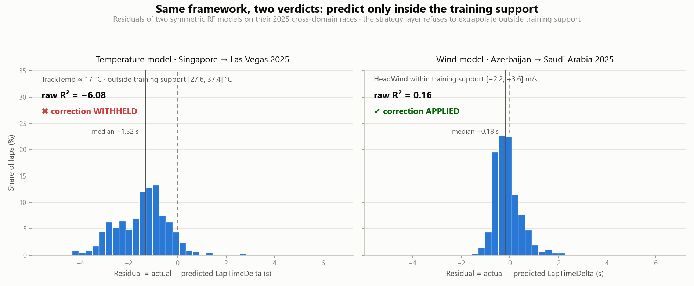
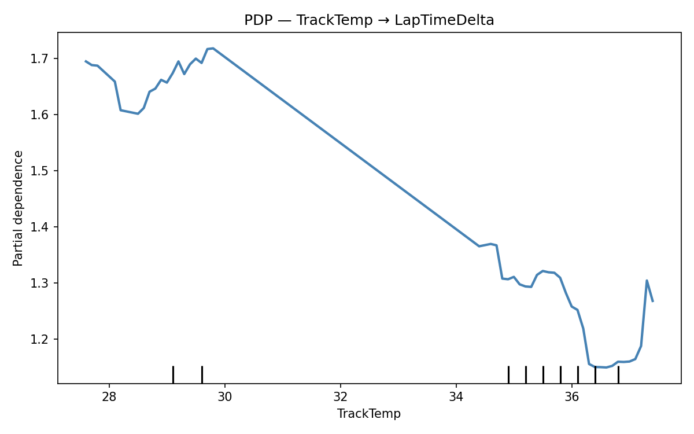
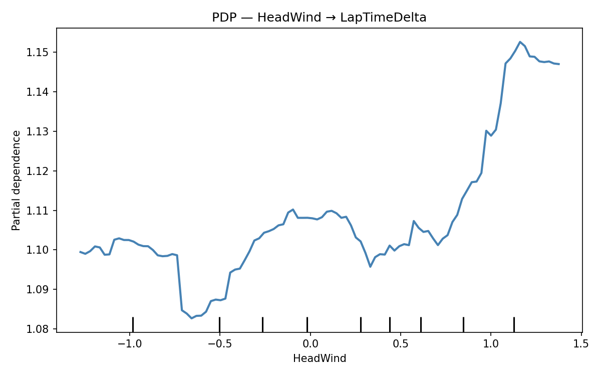

# 方法論

量化 2022–2025 地面效應時代的天氣如何影響 F1 單圈時間——並且測出這類模型從哪裡開始不再可信。

這是這份程式碼背後、可獨立閱讀的研究摘要。底下每一個數字都由本 repo 的管線產生，見[重現這些結果](#重現這些結果)。

## 1. 動機與研究問題

F1 的工程圈對天氣的說法多半是定性的：「高溫加速輪胎衰退」、「主直線的逆風會吃掉單圈時間」。這些說法在方向上大家都接受，卻很少被講成策略人員能拿來用的單位。這個研究專案問兩個問題：

1. **量化**——在輪胎狀態、油量與比賽進程都被控制之後，某個機制**每單位環境變化**（每 m/s 的風、每 °C 的溫度）究竟讓每圈多花幾秒？
2. **有效邊界**——這樣的模型在哪裡**不再管用**？迴歸模型對任何輸入都會樂意吐出一個數字；第二個問題是，能不能讓模型自己知道、而且講出來，它的答案什麼時候沒有統計依據。

兩個問題用同一套器材回答：兩項結構完全相同的研究——一個做風、一個做溫度——彼此**只有**被檢驗的那個因果變數不同。其中一項能跨賽道泛化，另一項在分佈外徹底失敗。這個對比，以及讓它能歸因於機制本身而非建模選擇的設計，就是核心結果。

## 2. 資料

- **來源**：經由公開的 [`fastf1`](https://docs.fastf1.dev/) API 取得的 F1 計時與天氣遙測資料。圈速表與天氣表逐場下載（`scripts/download.py`），再以 session time 做向後方向的 as-of 合併逐場接起來（`f1lab/data.py` 的 `RaceDataMerger`）——每一圈取到的是它時間戳當下或之前最近的一筆天氣樣本——然後每個賽道／時代寫成一份整齊的 Excel 檔（`scripts/merge.py`）。
- **時代**：2022–2025，地面效應的規則時代。四個賽季跑在同一套技術規則之下，這正是讓 2025 能當成**時代內**保留測試集、而不是規則變動的原因。
- **賽道**（四條，每項研究兩條）：

| 研究 | 訓練 + 同域測試 | 跨域測試 | 為什麼配這一組 |
|---|---|---|---|
| **wind** | 亞塞拜然 GP（Baku），2022–2024 訓練、2025 測試 | 沙烏地阿拉伯 GP（Jeddah），2025 | 風的物理條件相同：兩者都是高速街道賽道 |
| **temp** | 新加坡 GP，2022–2024 訓練、2025 測試 | Las Vegas GP，2025 | 2022–2025 賽程上唯一可用的低溫對照 |

- 前處理後的**工作矩陣**：wind 訓練資料 `X = (2248, 13)`；temp 訓練資料 `X = (2366, 14)`。欄數差異純粹來自輪胎配方的 one-hot：亞塞拜然的訓練場次用到 SOFT/MEDIUM/HARD（3 個指示欄），新加坡還出現過 INTERMEDIATE（4 個）。

## 3. 對稱的雙軸設計

方法論上的核心想法：**兩個模型共用一組完全相同、9 個控制變數的基線，以及完全相同的訓練／驗證／測試切分，彼此只有各自主張的那兩個因果變數不同。** 因此兩項研究之間任何行為差異，都可歸因於機制本身與它的訓練分佈——而不是模型選擇、特徵集不對稱，或切分的運氣。

**共用的基線控制變數**（`BASE_FEATURES`，9 個）：

| 特徵 | 定義 |
|---|---|
| `LapNumber` | 比賽進程——任何單圈時間模型的混淆因子（同時驅動輪胎磨耗累積與油量動態） |
| `LapInStint` | 該圈在車手 stint 內的原始位置，在無效圈過濾**之前**算好，讓存活下來的圈保住它真正的 stint 位置 |
| `Compound` | 輪胎配方，one-hot 編碼 |
| `TyreLife` | 輪胎的原始絕對圈齡（沿用輪胎時會跨 stint 累加） |
| `TyreLifeNorm` | `TyreLife / max(車手 stint 內的 TyreLife)`——stint 內的相對位置，落在 (0, 1] |
| `FreshTyre` | 新胎旗標 |
| `FuelLoad` | `110 − LapNumber × 1.7` kg（已發表的燃油消耗模型；Cappello, 2025） |
| `Humidity` | 天氣狀態——影響空氣密度（阻力），兩項研究都需要 |
| `Rainfall` | 天氣狀態——影響地面抓地力，兩項研究都需要 |

**各研究專屬的因果變數**（各 2 個，所以每項研究共 11 個特徵）：

| 研究 | 因果特徵 |
|---|---|
| **wind** | `HeadWind = WindSpeed × cos(WindDirection°)`、`CrossWind = WindSpeed × sin(WindDirection°)` |
| **temp** | `AirTemp`、`TrackTemp`（原始天氣欄位） |

設計原則是：**在基線裡的都是控制變數，各研究專屬的才是被主張的成因。** `AirTemp`／`TrackTemp` 刻意排除在 wind 研究之外（反之亦然）——把它們放進來，等於讓另一個機制的訊號漏進正在受檢驗的那個因果主張裡。早期有一個 `TyreLifeNorm × TrackTemp` 的交互作用特徵，正是因為這個理由被移除（它從後門把溫度帶進了風的模型），而且樹系集本來就會從主效應隱式學到這類交互作用。

**預測目標**（共用）：`LapTimeDelta = LapTime − min(車手 stint 內的 LapTime)`，單位為秒。每一圈都拿自己所屬 stint 的最佳圈來比，這會把車手／賽車／賽道演進造成的水平差異正規化掉，留下 stint 內的衰退訊號。

**無效圈過濾**（共用）：丟掉進站圈與出站圈、非全綠旗的圈（`TrackStatus ≠ '1'`），以及緊接在這兩者之後的那一圈——那些圈反映的是車流、安全車配速或冷胎，不是本研究要看的機制。stint 位置相關的特徵先在**未過濾**的資料上算好，所以過濾永遠不會扭曲某一圈在它 stint 裡的記錄位置。

**前處理管線**——兩項研究跑的是一模一樣的固定順序（`BaseLapPreprocessor.run()`，一個子類別無法改變其順序的 template method）：

1. 依 `RaceYear → GPName → Driver → LapNumber` 排序
2. 在**未過濾**的資料上做共用特徵工程（`LapInStint`、`TyreLifeNorm`、`FuelLoad`）
3. 套用無效圈過濾
4. 做各研究專屬的特徵工程（因果軸——風的分量或原始溫度）
5. 計算預測目標 `LapTimeDelta`
6. 組出特徵矩陣：選欄位、對 `Compound` 做 one-hot、評估時把欄位對齊到訓練時的特徵清單

要接上一項新研究，只需要宣告 `experiment_name` 與它的 `feature_columns`——基底類別會自動註冊——所以這個對稱結構是由架構強制的，不是靠慣例維持的。

## 4. 切分紀律

- **訓練集**：2022–2024 依時序（`RaceYear → GPName → Driver → LapNumber`）取前 80%
- **驗證集**（時代內的保留集，用於模型選擇）：2022–2024 的後 20%
- **測試集**（真正沒見過）：2025 的整場賽事
- 超參數搜尋**只在**那 80% 的訓練段內使用 `TimeSeriesSplit(n_splits=5)`——沒有任何一折會用到晚於自己評估區段的資料來訓練。

時代邊界很重要：2022–2025 屬於同一套規則體制，所以 2025 量的是**時代內的泛化能力**——也就是實務上真正關心的問題（「上個賽季的模型明年還能用嗎？」）——而不是把模型誤差跟規則變動混在一起。

**年度之間的漂移是當成發現來回報的，絕不用重新訓練把它蓋掉。** 2025 測試集的殘差呈現一致的中位數偏移（wind 約 −0.17 秒、temp 約 −0.37 秒）：以 2022–2024 訓練出來的模型，系統性地高估了 2025 的單圈時間差，因為 stint 內的離散程度在訓練賽季與 2025 之間收窄了（亞塞拜然的 delta 中位數 0.86 秒 → 0.71 秒，新加坡 0.82 秒 → 0.74 秒）。為什麼會收窄，這批資料無法定論——輪胎結構、比賽中斷、場次特有的動態都是候選——所以這個偏移是被量出來的，而不是被解釋掉的。處理方式是一個可選用的**事後殘差中位數偏差修正**（`ModelEvaluator.evaluate(..., bias_correct=True)`），它減掉殘差中位數，並且原始與修正後的指標都會報出來。2025 的資料從未進入訓練。RF 擬合出來的偏移量是：wind 同域 −0.17 秒、wind 跨域 −0.18 秒、temp 同域 −0.37 秒、temp 跨域 −1.32 秒——最後這一個本身就有診斷意義（見 §6）。

## 5. 模型與選擇

每項研究訓練三個迴歸模型——Decision Tree、Random Forest、XGBoost——各自跑一次獨立的 `GridSearchCV`（`TimeSeriesSplit(5)`，以 R² 評分），全程共用 `random_state=42`：

| 模型 | 網格組合數 | 每項研究的實際耗時（8 核 CPU） |
|---|---|---|
| DT | 648 | 約 30 分鐘 |
| RF | 1,875 | 約 26 小時 |
| XGB | 2,160 | 約 10 至 13 小時 |

完整跑完（兩項研究、所有模型）：**約 75 至 80 小時**。

網格是刻意設計成「被選中的值本身有解讀價值」：**每個軸上函式庫的預設值都搆得到**（「預設值勝出」是一個發現，不是網格沒涵蓋到），而且每個軸都留有**邊界餘裕**（例如 `n_estimators` 一路延到 2000，遠高於實務上約 1000 棵就進入平台期的位置，所以邊界被選中時可以回頭用 `cv_results_` 追問，而不是默默接受）。逐軸的理由寫在 `f1lab/models.py` 的行內註解。

**Decision Tree**（648 種組合）：

```python
"max_depth":          [None, 3, 5, 10, 20, 30]   # None 與 30 落在上界餘裕
"min_samples_leaf":   [1, 5, 10, 30, 90, 150]    # 1 = sklearn 預設
"min_samples_split":  [2, 10, 30, 50, 100, 200]  # 2 = sklearn 預設
"max_features":       [None, "sqrt", 0.5]        # None = 全部特徵
```

**Random Forest**（1,875 種組合）：

```python
"n_estimators":      [200, 500, 1000, 1500, 2000]
"max_depth":         [None, 3, 5, 10, 20]
"min_samples_leaf":  [1, 5, 10, 30, 90]
"min_samples_split": [2, 10, 30, 50, 100]
"max_features":      ["sqrt", 0.5, 1.0]
```

**XGBoost**（2,160 種組合）：

```python
"n_estimators":     [200, 500, 1000, 1500, 2000]   # 與 RF 對齊
"max_depth":        [3, 6, 10, 15]                 # 6 = XGBoost 預設
"learning_rate":    [0.05, 0.1, 0.2, 0.3]          # 0.3 = XGBoost 預設
"subsample":        [0.7, 0.85, 1.0]               # 1.0 = 預設
"colsample_bytree": [0.7, 0.85, 1.0]               # 1.0 = 預設
"min_child_weight": [1, 5, 10]                     # 1 = 預設
```

XGBoost 其餘的正則化旋鈕（`reg_alpha`、`reg_lambda`、`gamma`）刻意排除——它們屬於微調軸，放進來會讓網格衝破約 20,000 種組合，換到的洞見卻很有限。注意底下的結果：兩個勝出的 XGB 設定，在真正重要的軸上都沒有貼著邊界；兩項研究都選了 `learning_rate=0.05` 與很淺的 `max_depth=3`，也就是說搜尋空間還有餘裕，而它選擇了較保守的設定。

**保留集比較**（驗證集 = 2022–2024 的後 20%）：

| 研究 | 模型 | 保留集 R² | MAE | RMSE | 選中的超參數 |
|---|---|---|---|---|---|
| wind | DT | 0.663 | 0.614 | 0.982 | max_depth=10, max_features=sqrt, min_samples_leaf=1, min_samples_split=50 |
| wind | RF | 0.734 | 0.562 | 0.871 | max_depth=None, max_features=0.5, min_samples_leaf=5, min_samples_split=2, n_estimators=1500 |
| wind | XGB | **0.799** | 0.554 | 0.759 | colsample_bytree=1.0, learning_rate=0.05, max_depth=3, min_child_weight=5, n_estimators=200, subsample=0.7 |
| temp | DT | 0.648 | 0.575 | 0.838 | max_depth=3, max_features=0.5, min_samples_leaf=1, min_samples_split=2 |
| temp | RF | **0.685** | 0.522 | 0.793 | max_depth=10, max_features=sqrt, min_samples_leaf=1, min_samples_split=2, n_estimators=500 |
| temp | XGB | 0.668 | 0.542 | 0.813 | colsample_bytree=0.7, learning_rate=0.05, max_depth=3, min_child_weight=1, n_estimators=500, subsample=0.85 |

**為什麼主模型是 Random Forest。** RF 在兩項研究裡的保留集 R² 都落在最佳值的 0.07 以內（wind：RF 0.734 對 XGB 0.799，差距 0.065；temp：RF 以 0.685 直接勝出）——保留集上沒有決定性的贏家。接著 RF 在這個專案真正在意的地方勝出：2025 測試集的泛化能力（temp 研究：同域 RF 測試 R² 0.420 對 XGB 0.254；跨域 RF −6.080 對 XGB −17.420），以及機制抽取那一步的 PDP 穩定性——系集帶來的變異縮減會產生更平滑、更可信的反應曲線。三模型比較的存在，正是為了讓這個選擇是實測出來的，而不是講出來的。

## 6. 結果

兩項研究都在四種條件下評估：{同域、跨域} × {原始、偏差修正後}，三個模型全跑。格子格式為 **MAE / MSE / RMSE / R²**（MAE 與 RMSE 單位為秒）。

**Wind（亞塞拜然 → 沙烏地阿拉伯）：**

| 設定 | DT | RF | XGB |
|---|---|---|---|
| 亞塞拜然同域，原始 | 0.526/0.505/0.711/−0.042 | 0.457/0.383/0.619/**0.209** | 0.463/0.377/0.614/0.221 |
| 亞塞拜然同域，偏差修正 | 0.516/0.506/0.711/−0.044 | 0.435/0.395/0.628/0.186 | 0.423/0.381/0.617/0.213 |
| 沙烏地跨域，原始 | 0.516/0.522/0.723/−0.017 | 0.460/0.430/0.656/**0.163** | 0.465/0.437/0.661/0.149 |
| 沙烏地跨域，偏差修正 | 0.496/0.520/0.721/−0.013 | 0.435/0.432/0.657/0.159 | 0.440/0.436/0.660/0.151 |

**Temp（新加坡 → Las Vegas）：**

| 設定 | DT | RF | XGB |
|---|---|---|---|
| 新加坡同域，原始 | 0.850/2.813/1.677/0.378 | 0.885/2.621/1.619/**0.420** | 1.281/3.375/1.837/0.254 |
| 新加坡同域，偏差修正 | 0.835/2.912/1.706/0.356 | 0.821/2.718/1.649/0.399 | 0.932/2.967/1.722/0.344 |
| Las Vegas 跨域，原始 | 1.821/4.192/2.047/−8.244 | 1.516/3.211/1.792/**−6.080** | 2.346/8.353/2.890/−17.420 |
| Las Vegas 跨域，偏差修正 | 0.781/1.015/1.008/−1.239 | 0.817/1.123/1.060/−1.477 | 1.590/3.437/1.854/−6.580 |

**主要對比（RF）：**

- **風能泛化。** 跨域原始 R² 0.163 與同域的 0.209 相當接近（偏差修正後：0.159 對 0.186）。一個只在 Baku 訓練的模型能轉移到 Jeddah，退化幅度不大而且量得出來——兩條賽道共享同一套風的物理條件，模型學到的反應能帶過去。
- **溫度在分佈外徹底失敗。** 跨域原始 R² 是 **−6.080**——比直接預測平均值還差一個數量級。Las Vegas 的賽道溫度（約 17 °C）遠低於新加坡整個訓練範圍（27.6–37.4 °C）；模型從沒見過低溫這個區間，它的外推不只是不準，而是系統性地錯（要把它部分救回來所需的 −1.32 秒偏移，本身就是區間錯配的證據）。

這個不對稱——物理區間相符時外推可用、不符時輸出不可用——就是其餘設計存在的目的所要支撐的發現：兩項研究用同一組「扣掉成因」的基線、同一套切分、同一批網格、同一個主模型，所以能解釋這個差異的自由度就只剩機制本身，以及它的訓練支撐區間止於何處。



## 7. 機制抽取

光有預測準確度回答不了第 1 個問題（§1）。每單位的效應是從訓練好的 RF 以**部分依賴**抽出來的：PDP 是模型的平均反應 `f(特徵) → LapTimeDelta`，對其餘所有特徵的訓練分佈做邊際化。**ICE 曲線**（individual conditional expectation，抽樣成 200 條並疊上 PDP）是穩定性檢查——用來確認平均曲線反映的是跨樣本一致的反應，而不是被少數離群 stint 拖出來的形狀。`scripts/mechanism.py` 會產生全部 8 張圖（四個因果特徵各一張 PDP 與一張 ICE）。

**訓練支撐區間**（模型實際看過的特徵範圍——這一節在 §8 會變成承重結構）：

| 研究 | 特徵 | 範圍 | 平均 | 跨距 |
|---|---|---|---|---|
| Wind | HeadWind | [−2.24, +3.60] m/s | +0.18 | 5.84 |
| Wind | CrossWind | [−2.74, +3.79] m/s | −0.08 | 6.53 |
| Temp | AirTemp | [26.80, 31.20] °C | 29.74 | 4.40 |
| Temp | TrackTemp | [27.60, 37.40] °C | 34.36 | 9.80 |

**抽出來的量值**（由 RF 的 PDP 讀出，只在上述支撐區間內有效）：`TrackTemp` 在它單調的區段上斜率約為 **−0.06 秒每 °C**——在新加坡觀測到的窗口內，賽道表面越熱，單圈時間差反而**越小**，這與輪胎運作在更接近其工作溫度窗口的情況一致。`CrossWind` 呈現近乎線性的上升，約 **+0.03 秒每 m/s**。`HeadWind` 在中段是平的，超過約 +1.2 m/s 之後往上跳一階再進入平台——這個形狀正是底下策略情境的驅動力。這些是樹系集的平均邊際效應，不是因果係數；疊上去的 ICE 確認了這些形狀是整個母體的，而不是少數 stint 造成的假象。

|  |  |
|---|---|

## 8. 策略應用

為了讓抽出來的反應函式真的做點事，兩項研究餵給同一個下游決策：一次 **undercut 評估**（現在進站，以在賽道上超過對手）。每圈的環境修正量是

```
Δ = f(當前值) − f(訓練平均)
```

由預先算好的 PDP 網格以線性內插讀出（`f1lab/strategy.py` 的 `UndercutScenario`）。這個修正量**只在** `current_value` 落在訓練支撐區間 `[feature.min(), feature.max()]` 之內才套用；落在外面時輸入就是 OOD，PDP 沒有定義，修正量會被**收回**，而不是默默外推。

兩個情境共用一模一樣的策略桌參數：`pit_loss = 20.0 秒`、未修正的 `gap = 19.50 秒`、我方新胎出站圈 `95.20 秒`、對手舊胎進站圈 `95.50 秒`、對手剩 10 圈。淨成本 `= 20.0 + 95.20 − 95.50 = 19.70 秒`；餘裕 `= 19.50 − 19.70 = −0.20 秒` → 未修正的決策在兩個情境都是 **CLOSE**（不要進站）。相對地，環境條件用的是 2025 年真實量測到的值，不是假設。

| | 沙烏地阿拉伯 2025（風） | Las Vegas 2025（溫度） |
|---|---|---|
| 當前條件 | 實測**最大** HeadWind **+1.38 m/s**（全場平均 −0.31 落在 PDP 的平坦區；undercut 是單圈決策，所以適用當下那個值） | 實測平均 TrackTemp **17.27 °C** |
| 訓練支撐區間 | [−2.24, +3.60] m/s → **在區間內** | [27.60, 37.40] °C → **OOD** |
| PDP 讀值 | f(+0.18) = +1.108 秒、f(+1.38) = +1.147 秒 | 27.6 °C 以下沒有定義 |
| 每圈 Δ | **+0.039 秒** | **收回** |
| 10 圈累計 | +0.389 秒 → 修正後 gap **19.89 秒** | — |
| 修正後決策 | 19.70 < 19.89 → **OPEN**——決策在真實量測到的風下從 CLOSE 翻成 OPEN | **無法評估**（跨域 R² −6.080 佐證了這一點） |

兩欄之間的不對稱**只有**「在區間內／OOD」這個判定——同一個類別、同一組參數、同一套算術。而且這道守門對於自己拒絕什麼很精確：`net`、`gap` 與未修正的決策永遠都會算（它們是策略參數上的算術，不是模型輸出）；被收回的只有依賴模型的修正項與修正後的 gap。這種「知道什麼時候不該預測」的行為是設計出來的功能，不是故障模式：一個黑盒迴歸器在 17 °C 會很有自信地吐出一個錯的 Δ，而 §6 用實測（R² −6.080）說明了那會錯得多離譜。這個適用性判斷刻意寫得很簡單——當前值是否落在觀測到的訓練範圍內——所以真人策略員可以即時查核它。

## 9. 限制

這裡講得直白，因為有效邊界那個問題（§1）是雙向的：

- **PDP 假設特徵獨立。** 部分依賴是在其餘特徵的觀測聯合值上做邊際化；特徵之間相關就會讓曲線有偏。抽出來的量值是樹系集的平均邊際效應，不是因果係數。
- **`FuelLoad` 是 `LapNumber` 的確定性函數**（`110 − LapNumber × 1.7`）——在建構上就完全共線。兩者的特徵重要度必須合在一起解讀；模型無法把燃油消耗跟其他所有隨比賽進程單調變化的東西分開。
- **機制隔離是用變數省略實作的，不是統計控制。** 風的模型單純就是看不到溫度（反之亦然），所以被省略的機制與被納入的機制之間只要有相關，就會在學到的反應裡變成遺漏變數偏誤。
- **`WindDirection` 是原始的羅盤方位角**，沒有旋轉到賽道朝向，所以 `HeadWind`／`CrossWind` 只在「每條賽道有固定佈局」這個意義下是相對於賽道的。這正是風的跨域測試只挑物理條件相容的賽道配對、而不是隨便挑一條的原因。
- **跨域配對帶著賽道幾何的混淆因子。** Jeddah 不是 Baku、Las Vegas 也不是新加坡；佈局、路面與下壓力等級的差異會跟著環境對比一起進來。temp 那一組的 OOD 判定對此是穩健的（溫度差距佔絕對主導），但跨域的差值不應該過度解讀。
- **策略桌的參數是示意用的。** 進站損失、gap、出站圈與進站圈時間是為了示範而挑的街道賽道典型量級——它們不是遙測量得到的量。只有環境輸入是 2025 年的真實量測值。
- **每項研究只在單一賽道上訓練。** 每個模型學到的是一條賽道上該機制的表現形式；沙烏地那次轉移顯示這是可以泛化的，但一次成功的轉移是證據，不是通用可攜性的證明。
- **PDP 的不確定性在樣本稀疏處會變大。** 靠近訓練支撐區間邊緣時，曲線是靠很少幾圈撐起來的；本文沒有報告信賴區間，所以邊緣附近的讀值只有方向性，不夠精確。

## 重現這些結果

上面每一項都能由原始碼以一道指令重新產生——`python main.py` 會跑完整的 32 道指令序列：6 次訓練（3 模型 × 2 研究）→ 24 次評估（3 模型 × 4 條件 × 2 研究）→ `scripts/summarize.py`（把 log 彙整成 `summary/metrics.csv` 24 列與 `summary/best_params.csv` 6 列）→ `scripts/mechanism.py`（8 張 PDP/ICE 圖 + 兩張情境表）。在 8 核 CPU 上預算約 75 至 80 小時；全程有設種子（`random_state=42`）且為確定性。想先做快速健全檢查：`python -m pytest tests/ -q`（17 個測試，合成 fixture，不需要賽事資料）以及 `python scripts/train.py --experiment wind --model all --quick --no-plots`（約 15 秒的冒煙測試，跑在極小網格上，不可能覆寫已存的模型）。資料取得與逐步指令在 [README](../README.md)。
